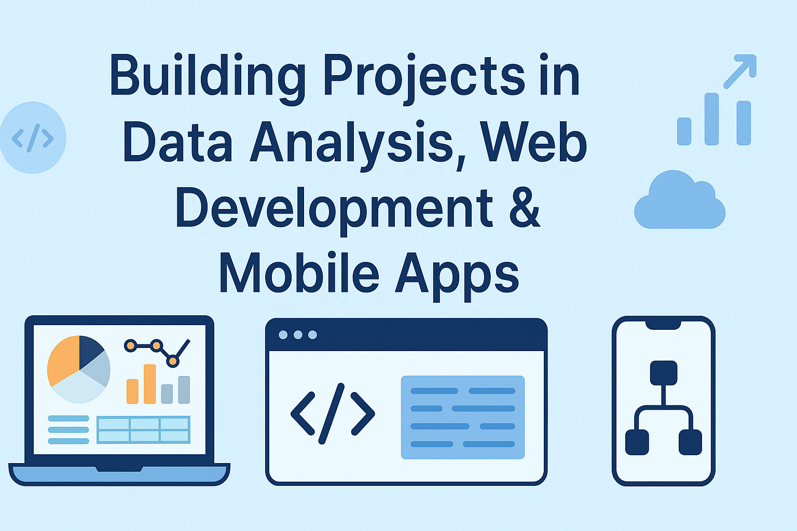

  

  
  
  
  
  
  
  
  

# 👋 Bienvenue sur mon profil GitHub !

Je suis passionné par :

- 📊 L’analyse de données (Python, Pandas, Matplotlib…)
- 🌐 Le développement web (HTML, CSS, JavaScript)
- 📱 Le développement d'applications mobiles

🎯 Objectif : Créer des projets utiles, clairs, et visuellement engageants !

📚 Actuellement, je mets en place un programme personnel pour apprendre le codage étape par étape.

💡 Toutes mes activités sur GitHub sont réalisées sur mon temps libre.  
J'ai suivi des études en **biostatistiques**, **analyse de données** et **bases de données**,  
mais **je ne travaille pas professionnellement dans la programmation**.

📬 N’hésite pas à consulter mes dépôts pour en voir plus !

## 🚧 En cours :
- Un projet d’analyse statistique sur les traitements vétérinaires
- La création d’un site web personnel
- Une application de cartes mentales pour le collège

---

# 👋 Welcome to my GitHub profile!

I'm passionate about:

- 📊 Data analysis (Python, Pandas, Matplotlib…)
- 🌐 Web development (HTML, CSS, JavaScript)
- 📱 Mobile application development

🎯 Goal: To build clear, useful and visually engaging projects!

📚 I am currently setting up a personal program to learn coding step by step.

💡 All my activities on GitHub are done during my free time.  
I have studied **biostatistics**, **data analysis**, and **database management**,  
but **I do not work professionally as a developer**.

📬 Feel free to check out my repositories!

## 🚧 Currently working on:
- A data analysis project on veterinary treatments
- A personal website project
- A mobile app for school mind maps (middle school level)

---

## 🧠 Projets personnels | 

🔹 [analyse-produits-veterinaires](https://github.com/Clemennt/analyse-produits-veterinaires)  
Analyse statistique complète sur l’utilisation des produits vétérinaires (antiparasitaires, vaccins, etc.) avec visualisations et rapport.

🔹 [site-web-personnel](https://github.com/Clemennt/site-web-personnel)  
Un site web vitrine personnel pour présenter mes projets, visualisations et expériences.

🔹 [app-cartes-mentales](https://github.com/Clemennt/app-cartes-mentales)  
Une application mobile destinée aux collégiens pour synthétiser les cours avec des cartes mentales interactives.

---

## 🧠 Personal Projects | 

🔹 [analyse-produits-veterinaires](https://github.com/Clemennt/analyse-produits-veterinaires)  
A full statistical analysis of veterinary product usage (antiparasitics, vaccines, etc.), with visualizations and report.

🔹 [site-web-personnel](https://github.com/Clemennt/site-web-personnel)  
A personal showcase website to present my data projects, visualizations and tools.

🔹 [app-cartes-mentales](https://github.com/Clemennt/app-cartes-mentales)  
A mobile app to help middle school students organize their lessons using interactive mind maps.

---
